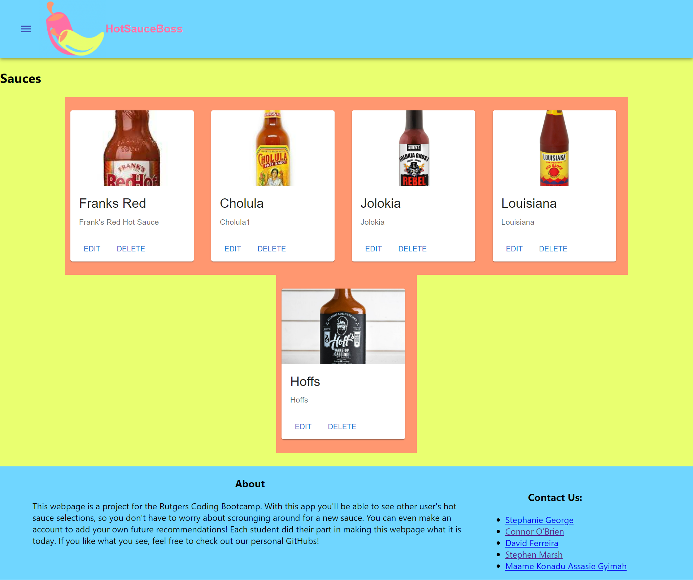
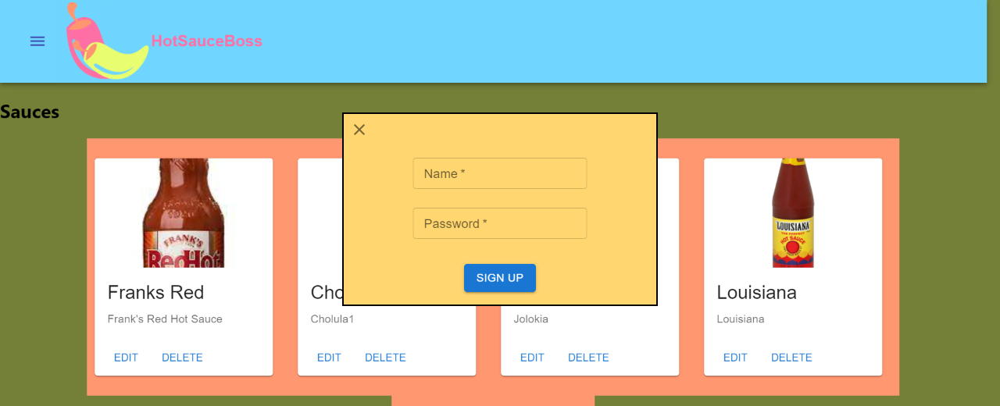
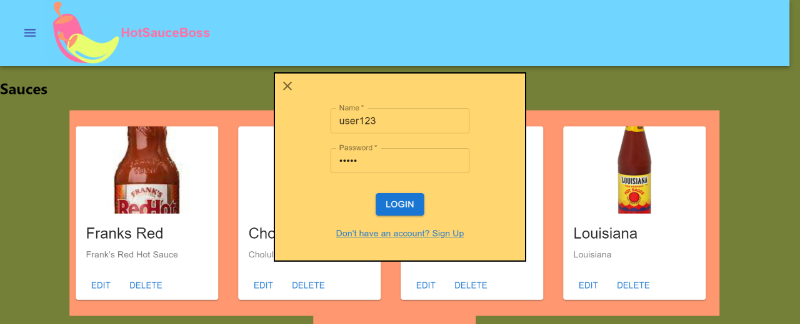

# Hot Sauce Boss

This application is the final group project for the Rutgers Coding Bootcamp.

## Description 

Scenerio: you're having a late-night dinner, and you're craving some hot sauce to go with your side of delicious wings. You open your fridge to reach for all those handy, flavor-filled sauces. You panic. You forgot to get the most important part of your meal. The hot sauce!!! 

Luckily for you, you have your handy-dandy Hot Sauce Boss app to help you with selecting some replacement sauces. With this app you'll be able to see other user's hot sauce selections, so you don't have to worry about scrounging around for a new sauce. You can even make an account to add your own future recommendations!

Always remember for every meal, the sauce is the boss!

## Table of Contents 
* [Deploy](#deploy)
* [Technologies Used](#technologies-used)
* [Usage](#usage)
* [Contributions](#contributions)
* [License](#license)

## Deploy

[Hot Sauce Boss](https://hot-sauce-boss.herokuapp.com/)

[Google Slides Presentation](https://docs.google.com/presentation/d/1X_mqOuRji18Zf1p0eE0-4mGU8K9AvyOHhM-bSWyNoAM/edit#slide=id.gede194eb96_1_25)

[Wireframe](https://user-images.githubusercontent.com/14891319/133174756-5d4b96cd-5d66-407d-b1bc-b317dfa62f03.png)

## Technologies Used

* 
* 
* 
* 
* 
* 
* 
* 

## Usage 

<!-- ### Demo:

* [Webpage Demo]()
* [Graphql Demo]() -->

### Landing Page:

When the user first enters the website, they are presented with the hot sauce dashboard.

### Sign-up Page:
 
Upon clicking sign-up, the user is brought to the user sign-up page. Once the user creates a new account they will be able to post their own collection of hot sauces.

### Login Page:

On the login page, the user is able to login if they sign out manually or are disconnect from wifi.

### Add Product Page:

The user can add a product to the dashboard.

### Edit Product Page:

From the dashboard, the user can edit the name and description of said product.

## Contributions

* [Stephen Marsh](https://github.com/Imaparadox)
* [Maame Konadu Assasie Gyimah](https://github.com/maa-hub)
* [David Ferreira](https://github.com/DiSantoz)
* [Stephanie George](https://github.com/stephgeorge22)
* [Connor O'Brien](https://github.com/JConnrO)

## License

MIT License

© 2021 ReciPlanner Inc.

Permission is hereby granted, free of charge, to any person obtaining a copy
of this software and associated documentation files (the "Software"), to deal
in the Software without restriction, including without limitation the rights
to use, copy, modify, merge, publish, distribute, sublicense, and/or sell
copies of the Software, and to permit persons to whom the Software is
furnished to do so, subject to the following conditions:

The above copyright notice and this permission notice shall be included in all
copies or substantial portions of the Software.

THE SOFTWARE IS PROVIDED "AS IS", WITHOUT WARRANTY OF ANY KIND, EXPRESS OR
IMPLIED, INCLUDING BUT NOT LIMITED TO THE WARRANTIES OF MERCHANTABILITY,
FITNESS FOR A PARTICULAR PURPOSE AND NONINFRINGEMENT. IN NO EVENT SHALL THE
AUTHORS OR COPYRIGHT HOLDERS BE LIABLE FOR ANY CLAIM, DAMAGES OR OTHER
LIABILITY, WHETHER IN AN ACTION OF CONTRACT, TORT OR OTHERWISE, ARISING FROM,
OUT OF OR IN CONNECTION WITH THE SOFTWARE OR THE USE OR OTHER DEALINGS IN THE
SOFTWARE.
